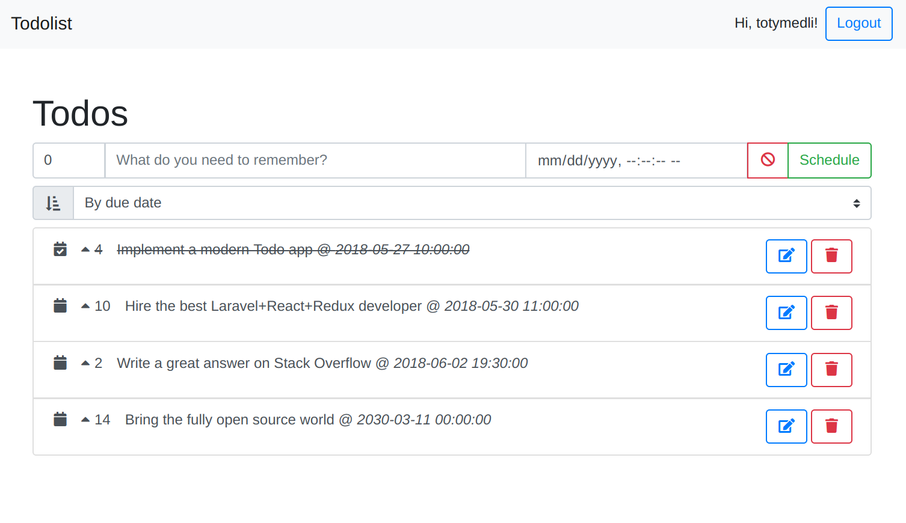

# Laravel + React + Redux Todolist

This repo holds an implementation for a todolist app writen with 2018 Q2 technologies.

## Features

- [REST](https://en.wikipedia.org/wiki/REST) [API](https://en.wikipedia.org/wiki/Application_programming_interface) to [CRUD](https://en.wikipedia.org/wiki/CRUD) todos (with priority and due date) and users.
- [SPA](https://en.wikipedia.org/wiki/Single-page_application) communicating with the API, providing user registration, login and ability to create, list, update, delete todos.
- Ordering todos by priority and due date.
- Marking finished todos.

## Technologies

### Backend

- [Laravel 5.6](https://laravel.com/docs/5.6)
 - [JWT](https://en.wikipedia.org/wiki/JSON_Web_Token) based auth through a proxied [Laravel Passport](https://laravel.com/docs/5.6/passport) OAuth 2.0 server.
- Dockerized environment via [Laradock](http://laradock.io).

### Frontend

- [React 16](https://reactjs.org) for component based view.
- [Redux 4](https://redux.js.org) for state management and time travel debugging.
- [Webpack 4](https://webpack.js.org) for bundling and [HMR](https://webpack.js.org/guides/hot-module-replacement).
- [React Router 4](https://github.com/ReactTraining/react-router) for declerative routing.
- [Babel](https://babeljs.io) for transpiling ES6 & ES7 syntax.
- [Bootstrap 4](https://getbootstrap.com) UI kit.
- [Font Awesome 5](https://fontawesome.com) svg based iconic font.
- Others: native HTML5 inputs, [moment.js](https://momentjs.com), [axios](https://github.com/axios/axios), etc...

## Install

Before executing each code snippet, make sure you `cd` back to the project's root folder!

For the backend You need to have Composer, Docker and Docker Compose:

	composer install # Install PHP dependencies
	php artisan key:generate # Generate an app key
    cd laradock
    docker-compose up -d nginx mysql phpmyadmin redis workspace # Start docker containers
    docker-compose exec workspace bash # Login to the workspace container
    artisan migrate # Run migrations to create database tables
    artisan passport:install # Generate Passport Oauth tokens and clients
    artisan app:copy-grant-credentials # Set oauth password grant client credentials for .env file 
    exit
    docker-compose ps # Check if anything is running well

For the frontend you need Node.js and NPM:

    cd resources/assets/js/app
	npm install # Install JS dependencies
    
To run the backend in dev mode, set `APP_PROD=false` in `.env` and keep running this in a console tab:

    cd resources/assets/js/app
    npm start

To run the backend in prod mode, set `APP_PROD=true` in `.env` then run the following command **only and every time you make changes**. This is similar to compiling:

    cd resources/assets/js/app
    npm run build

- Site runs on http://localhost
- PhpMyAdmin runs on http://localhost:8080 (server: mysql, user: root, pass: root)
- Webpack dev server runs on http://localhost:8081 (only needed with `APP_PROD=false`)
